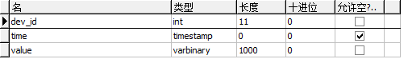
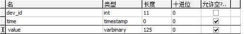
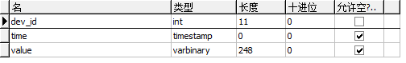
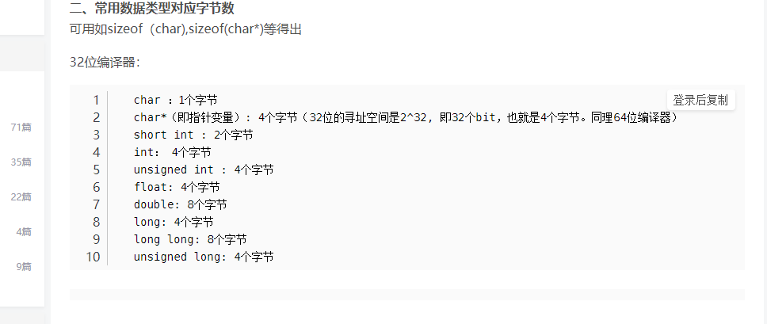

# 云端

1. 数据库中的数据格式
2. 确定需要发送的数据格式
3. 确定打包和解包的操作

## 1. 数据格式

确定数据库中的数据格式。

### 1.1 ECG

value存储的是每一秒钟存储的数据（单位是字节），因此根据ECG数据的大小和发送的频率可以确定需要的字节数是1000。

### 1.2 IBP2

这和ECG是类似的，也是存储每秒钟的数据，因此，根据数据每次采样的数据大小以及发送频率可以确定需要的字节为125。

### 1.3 SPO2

同理，数据长度为248字节。

## 2.发送数据的格式

有了数据库存储的数据之后，我们应该就可以确定要发送的数据格式了，以及什么时候该发送数据。

+ 每当数据存储满之后，发送数据，所以在设备端需要设置发送缓存。
+ 三种数据格式需要不用的缓存，此外，如何区分数据也是一个问题，或许还需要，上传设备的 ID 号码，以及本次数据的长度，或许还可以发送数据的类型，表明是哪个数据。

+ 接收端解析之后，运行对应的 SQL 语句讲数据插入进去即可

现在最关键的是确定发送数据的格式，到底该如何确定，QByteArray是我最终要的答案吗。

## 3. 打包和解包操作

有了前面的准备，这部分内容就可以非常自然地写出来了。

接下来是什么？需要把数据发送到医生端。

## 4. 如何把数据发往医生端

+ 再创建一个 Server，专门用来向医生端发送数据
+ 这个数据是需要用来画图的
+ 数据解析并不困难

现在的问题在于，表中的每一条记录都是 1s 内的数据，那么如何把数据正确的应用于画图，但是数据的刷新频率确实各不相同的，这该如何处理呢。

+ 设置三组接收队列和定时器，应对三种数据，定时器计时到之后，发出一个信号，进行画图

但这也有问题，如果是队列的话，什么时候该入队呢？或者说这是一个间断的请求？**干脆每次都只请求最新的数据好了，这样还能简化问题**，如果不在线的话，也没有问题。

+ 为每一个设备设置两个队列怎么样呢？两个队列可以解决什么问题？不是两个队列，另一个可以用List

  + 一个用来发出信号

    定时器到时间，如果队列不为空，立即从队列中请求数据，发出信号用于画图，同时从缓存队列中取出数据加入到本队列中。

  + 另一个用作缓存

    这个缓存要做的事情就是，每当空了时就去请求数据，这样一来的话，问题就解决了。

+ 然后需要考虑的就是数据解包了，这不是什么问题，不同的请求对应不同的数据包。

### 数据处理

因为涉及到多种请求信息，因此需要什么呢，需要包头来分辨不同的数据包。暂时先处理登录和波形数据请求，实际上更改用户信息，也是需要通过TCP上传的，这块儿先暂时不做处理。

+ 登录请求的数据头 

  即发送用户ID，和密码，希望返回是否允许登录的信息。

  **要不这部分也跳过吧，不去纠结了。**

+ 请求数据的头
  + 区分不同类型的数据还是沿用之前的写法，数据头也是类似。这样一来有很多代码可以重用，但是我没时间进行封装了。
  + 这样其实是高度耦合的，这种写法并不能应用到其他地方去，但先这样吧

就这样吧。

## 一些备用信息

